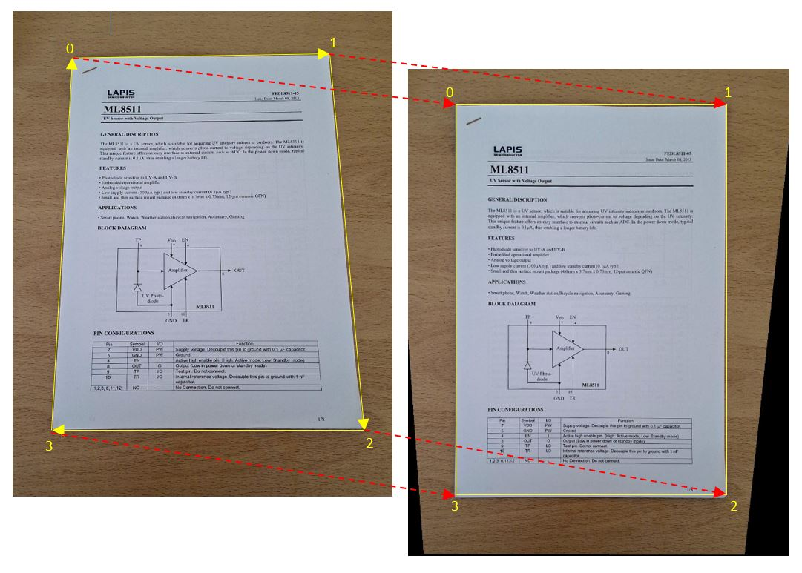

# ImageJ_Perspective_Correction
**ImageJ macro to correct/rectify the perspective of an image.**

Requires ImageJ version 1.51r  or higher.

Corrects the perspective by solving a homographic transformation
given the coordinates of 4 points on the input image
and the coordinates of the 4 corresponding points on the output image.

Uses the method described in: https://towardsdatascience.com/estimating-a-homography-matrix-522c70ec4b2c

The system of linear equations is solved using the Gauss-Jordan method described in Numerical recipes in C, see: http://s3.amazonaws.com/nrbook.com/book_C210.html
and: https://www.astro.umd.edu/~ricotti/NEWWEB/teaching/ASTR415/InClassExamples/NR3/legacy/nr2/C_211/recipes/gaussj.c

